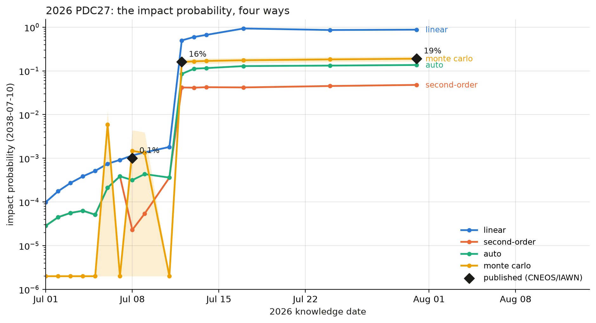

# 2026 PDC27: a hypothetical impactor, 26 nights of astrometry, and a 19% question

> **This scenario describes a fictional asteroid.** 2026 PDC27 is the
> hypothetical-impact exercise object for the International Academy of
> Astronautics **2027 Planetary Defense Conference** (Montreal, 3–7 May
> 2027). Quoting the JPL CNEOS exercise page: *"This webpage does not
> describe a real potential asteroid impact. The information on this
> page is fictional and provided only to support an emergency response
> exercise […] This is only an exercise."*

[](./main.py)
[](./main.rs)
[](./main.ipynb)
[](https://colab.research.google.com/github/Empyrean-Dynamics/empyrean-scenarios/blob/main/2026_PDC27/main.ipynb)

## The story (as scripted by the exercise)

On 2026-06-28 Pan-STARRS1 discovers a ~23rd-magnitude object whose
orbit crosses Earth's. By July 8 the impact probability for
**10 July 2038** creeps past 0.1%. Then the plot twist: on July 12,
precovery detections are found in Vera C. Rubin Observatory images
from May and June — the arc suddenly triples in length and the impact
probability **jumps to 16%**, triggering the first IAWN Potential
Impact Notification. JWST sizes the object at 80–85 m (S-type, rocky).
On July 31 the asteroid slips into the Sun's glare at 19% — where it
will sit, unobservable, until December 2026. Epoch 1 of the exercise
ends there: a one-in-five chance of a 10–50 Mt airburst somewhere
along a corridor that wraps more than halfway around the globe, and
nothing to do but wait for the next observing window.

This is the textbook planetary-astronomy decision problem — a short
arc, a long lever ahead (twelve years and ten orbits to the 2038
encounter), and a probability that will either collapse below the 1%
notification threshold or march toward certainty.

## What the scripts do

1. **Read the committed synthetic astrometry** (`empyrean.read_ades`)
   — 52 geocentric observations with per-observation uncertainties.
2. **Replay the knowledge timeline.** Observations are fitted
   *cumulatively in the order the exercise's astronomers had them*:
   the discovery arc night by night, then the Rubin precoveries
   injected on July 12 (not at their chronological positions), then
   the final tracking nights.
3. **At each step, compute the 2038 impact probability with every
   uncertainty method** — linear, second-order, AUTO-as-resolved, and
   budgeted Monte Carlo — producing one IP-evolution curve per method,
   with the exercise's published checkpoints (0.1% → 16% → 19%)
   overplotted as reference markers.
4. **Compare the endgame** against the published record: impact
   probability, encounter geometry, and the worst-case impact epoch
   2038-07-10 05:29:35.52 UTC carried by JPL Horizons.

The divergence (or agreement) of the uncertainty methods across a
twelve-year propagation is the point of the scenario: where the
estimates coincide, the linear mapping is adequate; where they
separate, the mapping has become strongly nonlinear, and κ quantifies
by how much (Park & Scheeres 2006).

## The figure



One probability, four estimates. After the July 12 precovery jump the
nonlinearity index κ sits between 13 and 50, and the analytic family
spreads across two orders of magnitude: the linear estimate lies above
the sampled value, the second-order estimate below it, and the
adaptive Gaussian mixture closest among the analytic methods — the
ordering expected at large κ (Park & Scheeres 2006; DeMars, Bishop &
Jah 2013). The Monte Carlo band agrees with each published checkpoint
(CNEOS / IAWN) within its 95% confidence interval.

## The data

- [`2026pdc27.epoch1.xml`](./2026pdc27.epoch1.xml) — the official
  Epoch-1 ADES XML released by JPL CNEOS (2026-08-01), byte-identical
  to the published file (SHA256 `4a1fccde…`).
- [`astrometry.psv`](./astrometry.psv) — the same 52 records
  transcribed field-for-field into ADES PSV (the format
  `empyrean.read_ades` consumes) by
  [`convert_astrometry.py`](./convert_astrometry.py), which
  self-verifies the transcription on every run. Only the constant
  `subFmt` field is dropped; no value is altered.

The observations are **synthetic and geocentric** (station code 500 —
the exercise dispenses with topocentric sites), with stated
uncertainties of 0.1″ (Rubin precovery + dark-time nights) and 0.2″
(discovery and twilight nights). They are noiseless by construction:
they sit on the exercise's truth trajectory to ~0.004″, and within
0.11″ of the published Horizons reference trajectory (`-937025`)
across the entire arc — so fitted χ² is essentially zero and the
covariance (hence the IP) is driven by the stated weights, exactly as
the exercise designers intended.

Scenario design and all source data: **NASA/JPL Center for Near-Earth
Object Studies (CNEOS)** — <https://cneos.jpl.nasa.gov/pd/cs/pdc27/>.
Impact risk assessment: **NASA Ames Asteroid Threat Assessment
Project** (L. Wheeler, A. Coates, R. Bennett, J. Mirza, M. Aftosmis,
J. Dotson). IAWN notifications 2026-07-15 and 2026-08-01. The
exercise pages carry no explicit license; they are NASA/JPL-Caltech
web products, and this directory redistributes only the small
astrometry file, unmodified, with this attribution.

## Reference values (Epoch 1, as published)

| Quantity | Reference value | Source |
|---|---|---|
| Potential impact date | 2038-07-10 | CNEOS exercise page |
| Worst-case impact time | 2038-07-10 05:29:35.52 UTC | JPL Horizons `-937025` |
| Impact probability (2026-07-08) | ~0.1% | exercise timeline |
| Impact probability (2026-07-12, precoveries) | 16% | exercise timeline / IAWN #1 |
| Impact probability (Epoch 1, all 52 obs) | **19%** | CNEOS / NEOCC / NEODyS concur |
| Orbit | e ≈ 0.410, q ≈ 0.665 au, i ≈ 13.76°, P ≈ 437 d | Horizons `-937025`, epoch 2026-08-01 |
| Absolute magnitude | H = 23.071 (G = 0.15) | Horizons `-937025` |
| Diameter | most likely 80–85 m (range 75–90 m), S-type | JWST (in-exercise), IAWN #2 |
| Impact energy | 10–50 Mt, most likely ~18–32 Mt | IAWN #2 / ATAP |
| Palermo / Torino | +0.8 / 3 (yellow) | exercise page |
| Risk corridor | Pacific → N. America → Atlantic → S. Europe → Mediterranean | IAWN #2 |
| Uncertainty region | >10 Earth diameters long, a few km wide | exercise page |

## Expected output (rough; ~20 min — per-step Monte Carlo)

```
52 synthetic observations (JPL CNEOS, Epoch 1)

knowledge date  n_obs  kappa      linear   2nd-order      auto        MC (95% CI)     published (CNEOS/IAWN)
2026-07-01      8     3.5    0.00010    0.00003    0.00003   0.000 ±0.000  
2026-07-02     10     3.9    0.00018    0.00004    0.00004   0.000 ±0.000  
2026-07-03     12     4.9    0.00027    0.00006    0.00006   0.000 ±0.000  
2026-07-04     14     6.1    0.00039    0.00006    0.00006   0.000 ±0.000  
2026-07-05     16    10.1    0.00051    0.00005    0.00005   0.000 ±0.000  
2026-07-06     18     3.5    0.00075    0.00021    0.00021   0.006 ±0.007  
2026-07-07     20     2.3    0.00092    0.00039    0.00039   0.000 ±0.000  
2026-07-08     22    50.9    0.00116    0.00002    0.00032   0.001 ±0.003    ← 0.001 published
2026-07-09     24    25.4    0.00137    0.00005    0.00043   0.001 ±0.003  
2026-07-10      26   (no converged solution yet)
2026-07-11     28     5.0    0.00181    0.00036    0.00036   0.000 ±0.000  
2026-07-12     42    13.6    0.49776    0.04172    0.08505   0.160 ±0.023    ← 0.160 published
2026-07-13     44    17.8    0.59708    0.04131    0.11234   0.165 ±0.023  
2026-07-14     46    20.8    0.66692    0.04232    0.11581   0.169 ±0.023  
2026-07-17     48    53.1    0.93359    0.04180    0.12865   0.175 ±0.024  
2026-07-24     50    35.9    0.86095    0.04504    0.13212   0.183 ±0.024  
2026-07-31     52    36.1    0.87714    0.04775    0.13638   0.190 ±0.024    ← 0.190 published

Epoch 1: MC 0.190 ± 0.024 vs 0.19 published (CNEOS / IAWN 2026-08-01);
  linear 0.877, second-order 0.04775, auto 0.136 at κ ≈ 36 — the ordering expected for a strongly
  nonlinear mapping (Park & Scheeres 2006; DeMars+ 2013; Roa+ 2021).
```

## References

- Park, R. S. & Scheeres, D. J. 2006, "Nonlinear mapping of Gaussian statistics: theory and applications to spacecraft trajectory design", *JGCD* **29**(6) — the second-order (STT) uncertainty mapping.
- DeMars, K. J., Bishop, R. H. & Jah, M. K. 2013, "Entropy-based approach for uncertainty propagation of nonlinear dynamical systems", *JGCD* **36**(4) — the adaptive Gaussian-mixture splitting.
- Roa, J., Farnocchia, D. & Chesley, S. R. 2021, "A novel approach to asteroid impact monitoring", *AJ* **162**(6) — impact-probability computation practice (Sentry-II).

## See also

- [The 2027 PDC Hypothetical Asteroid Impact Scenario — Epoch 1](https://cneos.jpl.nasa.gov/pd/cs/pdc27/) (CNEOS)
- [10th IAA Planetary Defense Conference, Montreal, 3–7 May 2027](https://iaaspace.org/)
- IAWN Potential Impact Notifications, 2026-07-15 and 2026-08-01 (linked from the CNEOS page)
- NASA Ames ATAP, *Impact Risk Assessment — 2026 PDC27 Epoch 1*
- JPL Horizons simulation body `-937025` (`2026 PDC27`)

*Future exercise epochs (the asteroid returns to view December 2026)
will extend this scenario as CNEOS releases them.*
