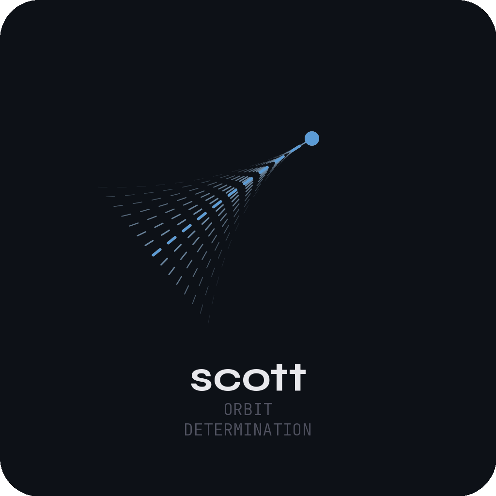

# empyrean-scenarios
Runnable Python walkthroughs of the explore-mode scenarios on empyrean-dynamics.com

<a href="https://github.com/Empyrean-Dynamics/empyrean-scenarios/actions/workflows/ci.yml"></a>
<a href="https://claude.ai"></a>
<br>
<a href="https://www.empyrean-dynamics.com"></a>
<a href="https://github.com/Empyrean-Dynamics"></a>
<a href="https://opensource.org/licenses/BSD-3-Clause"></a>

---

`empyrean-scenarios` is a collection of runnable Python scripts that
reproduce the planetary-science narratives from
[empyrean-dynamics.com/explore](https://empyrean-dynamics.com/explore)
end-to-end against the public `empyrean` package. Each script tells
one near-Earth-object or comet story using the same propagator,
orbit-determination, and event-detection engine that drives the live
explore mode — no hosted endpoint, no proprietary data, just
`pip install empyrean` against the publicly-available astrometry
catalogues.

## Built on

<a href="https://github.com/Empyrean-Dynamics/nolan"></a> <a href="https://github.com/Empyrean-Dynamics/villeneuve"></a> <a href="https://github.com/Empyrean-Dynamics/scott"></a>

| Component | Role |
|---|---|
| [`empyrean`](https://github.com/Empyrean-Dynamics/empyrean) | Public Python wrapper — the `pip install empyrean` distribution every script imports |
| [`nolan`](https://github.com/Empyrean-Dynamics/nolan) | Hyperdual automatic differentiation (Jet1, Jet2) — what the second-order STT propagation and the OD partials are built on |
| [`villeneuve`](https://github.com/Empyrean-Dynamics/villeneuve) | Orbital propagation, uncertainty propagation, event detection — close approaches, B-plane geometry, capture/escape, atmospheric entry |
| [`scott`](https://github.com/Empyrean-Dynamics/scott) | Orbit determination from optical astrometry — IOD + differential correction, with optional Yarkovsky / radiation-pressure non-grav solve |

## Quick start

```bash
pip install empyrean
git clone https://github.com/Empyrean-Dynamics/empyrean-scenarios.git
cd empyrean-scenarios
```

The first run of any scenario script downloads SPICE kernels (DE440,
MPC observatory codes, Earth orientation BPCs) into the platform's
XDG data directory; later runs reuse the cache.

## Conventions

Each script:

- Imports only from the public `empyrean` package surface (no private modules).
- Calls `empyrean.initialize()` once at the top.
- Pulls inputs from authoritative public sources — JPL SBDB, MPC, JPL CAD.
- Prints a small banner of the headline numbers (close-approach distances, IP, B-plane geometry) so the script doubles as a smoke test.
- Cites authoritative reference values inline in comments where they exist (e.g. JPL CAD nominal CA distance), so a reader can sanity-check what the toolkit produced against what JPL publishes.

The numbers each script prints are the same numbers that appear in the
narrative panel of `https://empyrean-dynamics.com/explore/{id}`.
If you find a discrepancy, file an issue — the explore-mode fixture and
this script run from the same engine, so any drift is a bug somewhere.

See [`docs/conventions.md`](docs/conventions.md) for the full spec.

## License

[BSD-3-Clause](LICENSE) — permissive, attribution-required.
Compatible with the rest of the Empyrean Dynamics public-distribution
chain.
